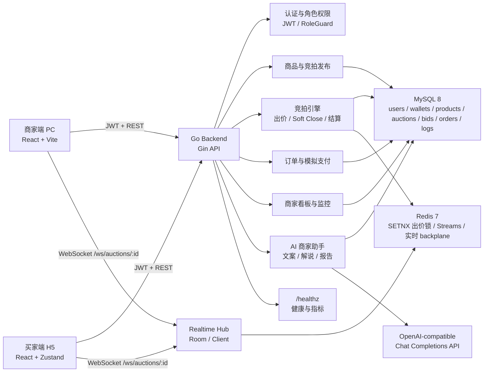
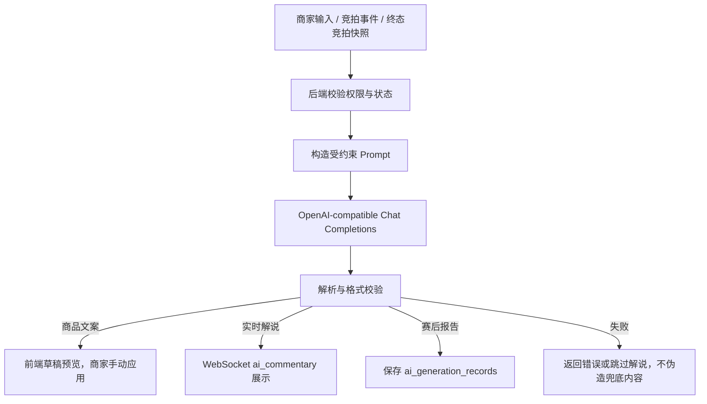

# 实时竞拍大师 - 交付材料草稿

> 当前整理日期：2026-06-09
> 资料来源：`README.md`、`requirements-v3.md`、`project.md`、`progress-report-v3.md`、`docs/demo-readiness.md`、`docs/performance-report.md`、`docs/ai-usage.md` 和当前代码结构。
> 说明：仓库内无法确认的信息已标注为“待补充”，提交前请按最终提交页和实际部署/录屏链接替换。

## 1. 课题名称

实时竞拍大师（Douyin Live Auction）

建议最终提交页保持同名，便于评委快速识别项目主题：面向抖音电商直播场景的实时竞拍系统。

## 2. 团队名称与成员名单

团队名称：待补充

| 成员 | 学校 | 专业 | 角色 |
| --- | --- | --- | --- |
| 林哥 | 待补充 | 待补充 | 独立开发者 / 全栈开发 / 产品与技术方案 |

仓库 `project.md` 记录当前项目为“林哥（1 人独立开发）”。如最终以小队提交，请在此补充所有成员姓名、学校、专业和角色。

## 3. 分工说明

当前按单人独立开发整理：

| 成员 | 分工 |
| --- | --- |
| 林哥 | 产品需求拆解、竞拍规则设计、后端 Go 服务、MySQL/Redis 数据层、WebSocket 实时通信、React 前端、AI 商家助手、演示数据、E2E 与压测材料、README/交付文档 |

如后续按小队提交，建议拆分为：

| 模块 | 负责人 |
| --- | --- |
| 前端 H5 买家端 | 待补充 |
| 商家端 PC 后台 | 待补充 |
| 后端 API 与竞拍引擎 | 待补充 |
| WebSocket / Redis / 并发一致性 | 待补充 |
| AI 商家助手 / Prompt / 模型接入 | 待补充 |
| 测试、部署、演示视频与文档 | 待补充 |

## 4. 核心功能清单

1. 商家商品与竞拍发布：商家可创建商品、上传图片、配置起拍价、加价规则、封顶价、竞拍时长和自动延时规则。
2. 实时直播竞拍：买家进入 H5 竞拍房间，通过 WebSocket 获取当前价格、倒计时、排行榜、竞拍终态和私有被超越通知。
3. 竞拍引擎与资金冻结：后端支持余额预冻结、被超越自动解冻、成交扣款、Redis 锁与数据库一致性保护。
4. 成交订单闭环：竞拍结束后生成订单，买家可确认中标、模拟支付，超时或取消会触发余额返还。
5. 商家运营后台：商家可查看商品列表、竞拍状态、订单列表、运营看板和单场实时竞拍监控。
6. AI 商家助手：提供商品文案草稿、实时竞拍解说、终局竞拍分析报告，AI 输出只辅助展示，不改变竞拍、钱包和订单状态。

## 5. 端到端使用流程

1. 商家登录系统后进入商家后台，创建商品并填写商品介绍、图片和竞拍规则。
2. 商家发布竞拍后，可在商品列表或看板中进入实时竞拍监控页。
3. 买家登录 H5 端，进入竞拍大厅并选择当前进行中的商品。
4. 买家在直播竞拍房间中查看当前价格、倒计时、排行榜和竞拍规则，并提交符合加价规则的出价。
5. 后端竞拍引擎冻结当前出价者余额，解冻被超越者余额，并通过 WebSocket 向房间广播价格、排名和倒计时变化。
6. 若触发 Soft Close，系统自动延长倒计时；若达到封顶价或时间结束，竞拍进入成交或流拍状态。
7. 成交后系统生成订单，中标买家进入订单页完成确认和模拟支付。
8. 商家可在订单页和竞拍监控页查看成交结果，也可生成 AI 赛后分析报告用于复盘。

## 6. 在线 Demo 链接

待补充。

当前仓库提供本地 Demo：

- 前端本地地址：`http://127.0.0.1:3000`
- 后端本地地址：`http://127.0.0.1:8080`
- 健康检查：`http://127.0.0.1:8080/healthz`

体验账号：

| 角色 | 用户名 | 密码 |
| --- | --- | --- |
| 商家 | `demo_merchant` | `test123` |
| 买家 A | `demo_buyer_a` | `test123` |
| 买家 B | `demo_buyer_b` | `test123` |

如无法部署公网 Demo，可提交演示视频或录屏链接作为替代。

## 7. 演示视频链接

待补充。

建议 3 分钟左右，按以下顺序录制：

1. 商家登录，进入看板和商品管理。
2. 商家创建或打开已 seed 的竞拍商品，进入实时监控页。
3. 买家 A 进入 H5 竞拍房间并出价。
4. 买家 B 出更高价，买家 A 收到被超越通知，排行榜和商家监控同步刷新。
5. 买家出到封顶价或等待竞拍结束，系统生成订单。
6. 中标买家确认订单并完成模拟支付。
7. 展示 `/healthz` 和压测/性能材料，说明并发一致性与可观测性。
8. 展示 AI 商品文案、AI 实时解说或 AI 赛后分析报告。

## 8. 源代码仓库链接

- 主仓库：<https://github.com/linz12306/douyin_live_auction.git>
- 当前分支：`master`
- 当前最后提交：`94c6d28 2026-06-09 merge: queued bid command stream`

提交前建议确认：

- 最终交付分支是否仍为 `master`。
- 是否需要标注演示分支或 release tag。
- 最新提交是否已经推送到远端。

## 9. README / 运行说明

项目根目录已有 `README.md`，包含项目简介、架构、启动方式、演示账号、核心功能和验证命令。可在提交页直接引用，也可使用以下精简版。

### 项目简介

实时竞拍大师是一个面向直播电商场景的本地 MVP，覆盖商家商品发布、竞拍激活与监控、买家实时出价、私有被超越通知、竞拍结算、订单确认和模拟支付。

### 依赖环境

- Go：`backend/go.mod` 当前声明 `go 1.26.3`
- Node.js / npm：用于前端 Vite、脚本和 Playwright
- MySQL 8：本地 Docker，默认 `127.0.0.1:3307`，数据库 `auction_db`
- Redis 7：本地 Docker，默认 `127.0.0.1:16380`
- 前端：React + Vite + TypeScript
- 后端：Go + Gin + gorilla/websocket

### 启动步骤

```bash
docker compose up -d mysql redis
```

```bash
cd backend
REDIS_ADDR=127.0.0.1:16380 go run ./cmd/server
```

```bash
cd frontend
npm run dev -- --host 127.0.0.1 --port 3000
```

```bash
DEMO_API_BASE_URL=http://127.0.0.1:8080 npm run demo:seed
```

打开 `http://127.0.0.1:3000` 体验。

### 目录结构

```text
backend/
  cmd/server/                 后端入口与路由注册
  internal/config/            配置、MySQL、Redis 初始化
  internal/handler/           HTTP 与 WebSocket handler
  internal/service/           业务服务、竞拍引擎、订单、AI、健康检查
  internal/repository/        MySQL 持久化访问
  internal/realtime/          WebSocket Hub、事件总线、Redis Streams backplane
  internal/model/             数据模型
  migrations/                 MySQL 表结构迁移
  tests/integration/          后端集成测试
frontend/
  src/api/                    前端 API client
  src/pages/app/              买家 H5 页面
  src/pages/merchant/         商家后台页面
  src/store/                  登录与实时房间状态
  src/components/             通用组件与商家组件
scripts/
  demo-seed.mjs               本地演示数据初始化
  load-auction.mjs            并发出价/WS 压测脚本
docs/
  demo-readiness.md           演示 runbook
  performance-report.md       性能与压测证据
  ai-usage.md                 AI 编码使用记录
openspec/
  specs/                      已归档能力规范
  changes/                    当前和历史 OpenSpec 变更
```

### 配置说明

后端关键环境变量：

| 变量 | 说明 | 默认值 |
| --- | --- | --- |
| `DB_DSN` | MySQL 连接串 | `root:auction123@tcp(127.0.0.1:3307)/auction_db?...` |
| `REDIS_ADDR` | Redis 地址 | `127.0.0.1:16380` |
| `REDIS_PASSWORD` | Redis 密码 | 空 |
| `JWT_SECRET` | JWT 签名密钥 | `dev-secret-change-me` |
| `SERVER_PORT` | 后端端口 | `8080` |
| `DISABLE_RATE_LIMIT` | 本地 E2E/压测时关闭限流 | 空 |
| `AI_BASE_URL` | OpenAI-compatible API base URL | 空 |
| `AI_API_KEY` | AI API Key | 空 |
| `AI_MODEL` | AI 模型名 | 空 |
| `AI_TIMEOUT_MS` | AI 请求超时 | `10000` |
| `AI_MAX_TOKENS` | AI 最大输出 token | `700` |

## 10. 系统架构图



## 11. 大模型 / AI 能力使用说明

系统内 AI 能力：

1. 商品文案助手：商家在商品表单中输入标题、描述和竞拍规则后，请求 `POST /api/v1/merchant/ai/product-copy`，后端调用 OpenAI-compatible Chat Completions API 生成标题、描述、卖点和直播话术草稿。草稿只预览，需商家手动点击应用，不会自动保存或覆盖商品。
2. 实时竞拍解说：竞拍事件提交后，AI 根据事件类型、价格、状态和版本生成一句短中文解说，通过 WebSocket `ai_commentary` 消息展示在买家直播间和商家监控页。该消息是氛围内容，不作为竞拍状态真理源。
3. 赛后竞拍报告：终态竞拍可调用 `POST /api/v1/merchant/ai/auctions/:id/report` 生成分析报告，数据来自商品、出价数、参与人数、成交价、持续时间、最后 30 秒出价占比等快照，并持久化到 `ai_generation_records`。

模型接入方式：

- 使用 OpenAI-compatible `/v1/chat/completions` 接口。
- 通过 `AI_BASE_URL`、`AI_API_KEY`、`AI_MODEL`、`AI_TIMEOUT_MS`、`AI_MAX_TOKENS` 配置。
- 未配置模型时，直接 AI API 返回清晰配置错误，实时解说跳过生成，不使用伪造内容兜底。

AI 辅助开发记录：

- `docs/ai-usage.md` 记录本项目使用 AI 进行需求拆解、OpenSpec/Superpowers 文档、代码导航、补丁草拟、测试设计和验证记录。
- AI 贡献估计：文档与机械实现 70-80%，产品决策、语义选择、风险接受由人类主导。

## 12. 关键工程难点与解决方案

### 难点 1：高并发出价下的钱包一致性

直播间同一商品会出现短时间大量出价，如果多个请求同时修改余额、冻结金额和最高价，容易出现重复成交、余额为负或多个 active bid。项目使用 Redis `SETNX` 做竞拍级短锁，并用数据库事务/行锁/乐观版本作为一致性保护；出价成功后冻结新出价、解冻被超越者，并保证同一竞拍只有一个 active bid。

### 难点 2：实时 UI 与后端真理源同步

REST 返回和 WebSocket 广播可能存在先后顺序差异。项目约定 WebSocket 是实时竞拍唯一真理源：REST 只做页面初始化和动作提交，价格、排名、倒计时、出价结果和终态都以 WS snapshot/update 覆盖前端 Zustand store，降低 UI 闪烁和状态倒退风险。

### 难点 3：竞拍倒计时与 Soft Close

最后时刻出价需要自动延时，同时不能无限延长。后端维护竞拍状态机和延时次数，临近结束时触发 Soft Close，把倒计时重置到指定窗口并广播 `extended` 消息；达到最大延时次数后不再延长，时间到或封顶价达到时进入终态。

### 难点 4：热点竞拍的请求峰值削峰

同步出价在高争用下会出现大量 Redis lock busy，能保护一致性但用户侧会收到较多 429。项目新增异步排队出价路径 `POST /api/v1/auctions/:id/bid/async`，先持久化 bid command，再由 Redis Streams worker 按竞拍顺序处理，不同竞拍可并行处理，兼顾削峰和状态一致性。

### 难点 5：AI 输出不能污染核心交易状态

AI 生成内容可能失败、为空或格式不稳定。项目把 AI 能力限制为展示辅助：商品文案只生成草稿，实时解说不参与状态判定，赛后报告只读取终态快照；所有竞拍、钱包、订单、排名仍由后端业务逻辑和数据库记录决定。

## 13. 项目亮点 / 创新点

1. 直播电商竞拍闭环完整：覆盖商家发布、买家实时出价、排行榜、Soft Close、成交确认、模拟支付、商家监控与订单管理。
2. 高并发一致性方案可演示：Redis 锁、数据库一致性保护、异步 bid command 队列、健康指标和压测脚本组成可验证的工程证据链。
3. AI 与业务边界清晰：AI 提供文案、直播解说和赛后复盘，增强演示表现力，但不改变交易正确性和状态真理源。

## 14. 其余材料

### 14.1 性能指标 / 压测结果

仓库已有 `docs/performance-report.md`。本地压测证据摘要如下：

| 场景 | 请求数 | 并发 | WS 连接 | 结果摘要 |
| --- | ---: | ---: | ---: | --- |
| 同步出价 Run 5 | 5000 | 500 | 150 | `200=64`、`400=12`、`429=4924`，无 5xx 或 timeout，p95 `343.67ms`，最大 `391.10ms` |
| 异步队列优化后 | 5000 | 500 | 300 | HTTP `202=5000/5000`，worker `accepted=246`、`rejected=4754`、`pending=0`、`failed=0`，Redis command group `pending=0`、`lag=0`，`/healthz dropped_events=0` |

一致性验证要点：

- 同一非终态竞拍 `active_bid_count = 1`。
- 成交订单不重复。
- 用户钱包 `balance` 与 `frozen_amount` 非负。
- `/healthz` 可展示 bid 请求量、成功率、平均延迟、lock busy、lock degraded、WS 连接数和 dropped events。

### 14.2 Prompt 策略 / Agent 流程图

Prompt 策略：

| AI 能力 | Prompt 约束 |
| --- | --- |
| 商品文案 | 系统提示限定“中文商品文案助手”，要求只返回严格 JSON，字段为 `title`、`description`、`selling_points`、`live_script`，并禁止承诺保值或投资收益。 |
| 竞拍报告 | 系统提示限定“直播竞拍数据分析师”，要求基于输入 JSON 生成 180 字以内中文报告，不编造输入中没有的数据。 |
| 实时解说 | 系统提示限定“AI 实时解说员”，要求一句中文短句，不超过 32 字，不编造用户姓名。 |

AI 工作流：



### 14.3 评测方案与样例结果

功能评测：

1. 使用 `npm run demo:seed` 创建演示账号和活跃竞拍。
2. 使用商家账号进入 `/merchant/dashboard` 和竞拍监控页。
3. 使用两个买家账号进入同一竞拍房间，依次出价，验证价格、排行榜、私有 outbid、Soft Close 和终态。
4. 使用订单页验证中标确认、模拟支付、取消/超时退款。
5. 使用 `/healthz` 和 `scripts/load-auction.mjs` 验证健康状态、并发指标和一致性证据。

自动化评测：

```bash
PLAYWRIGHT_BASE_URL=http://127.0.0.1:13000 npm run test:e2e:demo
```

后端与前端常用验证：

```bash
cd backend
REDIS_ADDR=127.0.0.1:16380 go test ./...
```

```bash
cd frontend
npm run test
npm run build
```

样例结果可从 `docs/performance-report.md` 和 `progress-report-v3.md` 中摘取。

### 14.4 用户反馈 / 内测记录

待补充。

建议补充 2-4 条来自同学、老师或试用用户的反馈，例如：

- 买家端是否能直观看到“我是否领先”和“何时结束”。
- 商家端是否能快速理解当前最高价、参与人数和订单结果。
- AI 文案和赛后报告是否对商家准备直播有帮助。
- 压测/健康检查材料是否能让评委快速理解工程可靠性。

## 提交前待补充清单

- [ ] 最终团队名称。
- [ ] 成员学校、专业、角色。
- [ ] 在线 Demo 公网链接或可访问部署说明。
- [ ] 演示视频公开链接。
- [ ] 最终提交分支、tag 或 commit hash。
- [ ] 若使用真实 AI 服务，补充模型名称与 API 提供方；不要提交 API Key。
- [ ] 若已有内测，补充用户反馈。
